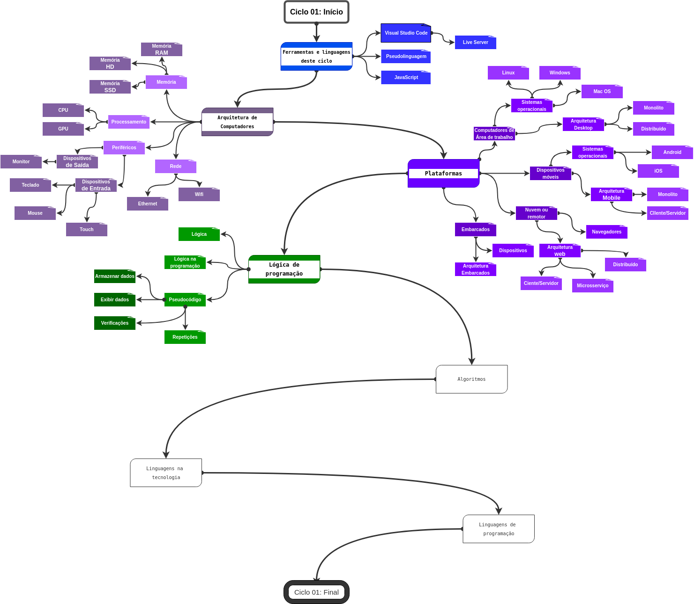

# Ciclo 01: Introdução

O ciclo 01 é o primeiro na trilha que você está começando, ele tem por objetivo trazer noções básicas que nivelam o conhecimento fundamental para que os próximos ciclos sejam entendidos com mais facilidades.

Tentarei trazer aspectos teoricos e torná-los práticos com exemplos e exercícios, porém entenda que é um ciclo quase que puramente teórico, então busque compreender bem os conceitos.

> ATENÇÃO:
>
> Compreender os conceitos aqui fará muita diferença quando for aprender sobre assuntos complexos.

### Assuntos

- Ferramentas e linguagens deste ciclo
- Arquitetura de computadores
- Plataformas
- Lógica de programação
- Algoritmos
- Linguagens na tecnologia
- Linguagens de programação

## Conteúdo

### Ferramentas e linguagens deste ciclo

Como ferramentas desse ciclo usaremos o Visual Studio Code e a extensão Live Server. Como linguagem de programação usaremos JavaScript e uma pseudolinguagem (usando português brasileiro).

Você tem autonomia para escolher as ferramentas e linguagens que preferir se tiver conhecimento para usá-las e souber que elas funcionarão, porém se você está começando do zero, sugero seguir as sugestões do conteúdo! 

> #### Visual Studio Code

Uma IDE para desenvolvimento que aceita muitas linguagens de programação. O projeto é open-source e de uso livre, tanto pessoal quanto comercial. É leve e uma excelente ferramenta.

Faça o download e instale o VSCode em seu computador [Clique aqui!](https://code.visualstudio.com/)

> #### Extensão: Live Server (Ritwick Dey)

A extensão Live Server permite executar páginas web estáticas diretamente do seu VSCode com recursos de atualização automática ao salvar o arquivo com o código.

A instalação é feita de dentro do VSCode, para instalar basta:

1. Clicar no menu extenções no menu lateral esquerdo da tela do VSCode
2. Digitar Live Server na caixa de pesquisa
3. Clicar sobre o Live Server do Ritwick Dey
4. Clicar no botão "install"

Para mais detalhes da extensão [Clique aqui!](https://marketplace.visualstudio.com/items?itemName=ritwickdey.LiveServer)

> #### Pseudolinguagem

Uma pseudolinguagem é uma linguagem mais simples e geralmente usando o idioma comum do profissional. Seu objetivo é permitir descrever uma lógica ou algoritmo sem se preocupar com regras de síntaxe ou outros formalismos de uma linguagem usada na tecnologia.

Neste material usaremos uma linguagem com poucas regras, basicamente lembre-se de:

- Ter apenas uma ação (verbo) por linha
- Use os comandos como se tivesse dando ordens (modo imperativo)
- Construa sua lógica pensando detalhadamente sem pular etapas
- Os passos devem ser sequenciais (respeite as ordens nos comandos)
- Comece seu grupo de comandos com INICIO e termine eles com FIM
- Evite usar verbos diferentes para a mesma ação (exemplo: Leia, Ler, Lido...)

Fora isso não se preocupe com outras coisas, apenas divirta-se montando seus pseudocódigos!

Explore mais sobre [Clique aqui!](https://pt.wikipedia.org/wiki/Pseudoc%C3%B3digo)

> #### JavaScript

JavaScript é uma linguagem de programação interpretada e amplamente usada em várias plataformas com seu principal uso em desenvolvimento de sites e aplicativos para a internet.

Não se preocupe se não ficou claro ou se não conhece JavaScript, eu escolhi ela para esse ciclo por sua simplicidade e por podermos testar sem a necessidade de instalar compiladores, porém o foco nesse ciclo são os conceitos e não a prática, então JavaScript não deve ser um desafio.

## FIXAÇÃO

### Atividade 01

Vamos verificar se o VSCode e a extensão Live Server estão funcionando corretamente 👀 Siga os passos a seguir:

1️⃣ Abra o VSCode

2️⃣ Escolha uma pasta em menu File > Open Folder (Fique a vontade para criar ou usar qualquer pasta para salvar esse exemplo que faremos)

3️⃣ Dentro da pasta crie um arquivo e nomeie como "MinhaPrimeiraPaginaEstatica.html" (Isso pode ser feitos de várias formas, uma delas é no menu File > New File)

4️⃣ Com o arquivo aberto no VSCode digite "html:5" e pressione o botão Tab (isso fará o template de um documento HTML ser criado para você)

5️⃣ Altere o conteúdo da tag title de Document para outra coisa (não se preocupe com o que colocará, tente se divirtir 😜)

6️⃣ Entre as tags body em uma linha vazia escreva h1 e pressione Tab (Isso fará surgir as tags de título H1) agora digite qualquer texto entre as tags H1

7️⃣ Salve o arquivo (há varias maneiras, mas pode usar um Ctrl + S)

8️⃣ Clique no botão "Go Live" no campo inferior direito do VSCode (aproximo ao 🔔)

🏁 Se tudo está instalado corretamente, deve abrir uma aba do seu navegador e mostrar um página com o texto que vocês escreveu em H1 e na aba do navegador deve ter o texto que você escreveu a tag title 👏

---

### Atividade 02

Vamos ver se conseguimos tornar o conceito de pseudolinguagem algo mais prático, acredito que a ideia principal você já entendeu, mas vou resumir "Escreva uma sequencia de passos para realizar algo um verbo por linha e sendo detalhista" 🤓

Bora lá então... Escreva um passo a passo que descreva você fazendo ovo frito (mais simples que isso é difícil hein haha) Para que você se force a ser detalhista, tem que ter ao menos dez passos.

---

### Atividade 03

Agora vamos ter nosso primeiro contato com a linguagem de programação javascript, para isso siga os passos abaixo:

1️⃣ Abra o navegador Google Chrome (espero que você não diga que não tem ele instalado 😱)

2️⃣ Independente do site em que esteja digite Ctrl + Shift + i (isso deve abrir a tela lateral de ferramentas do desenvolvedor)

3️⃣ Caso não haja um espaço em branco com o caractere `>`, verifique na parte superior da tela e clique na opção console

4️⃣ Clique na frente do simbolo ">" e digite `let meunome = "Sei lá meu nome"` e pressione enter

5️⃣ Agora digite `console.log(meunome)` e pressione enter

🏁 O texto que digitou depois do simbolo de "=" aparecerá na linha de baixo, e isso foi seu primeiro contato com javascript, mesmo sem saber você acabou de criar uma variável, adicionar um valor nela e depois exibir ela no console usando o comando console.log() 👏

Já pode começar um software para ser concorrente de algum aplicativo comum do mercado... Obviamente que não pequeno(a) gafanhoto, mas foi seu primeiro passo 🥹

---
---
---

   
   [Próximo: Arquitetura de computadores >>>](./ciclo-01-002-Arquitetura-De-Computadores.md)

